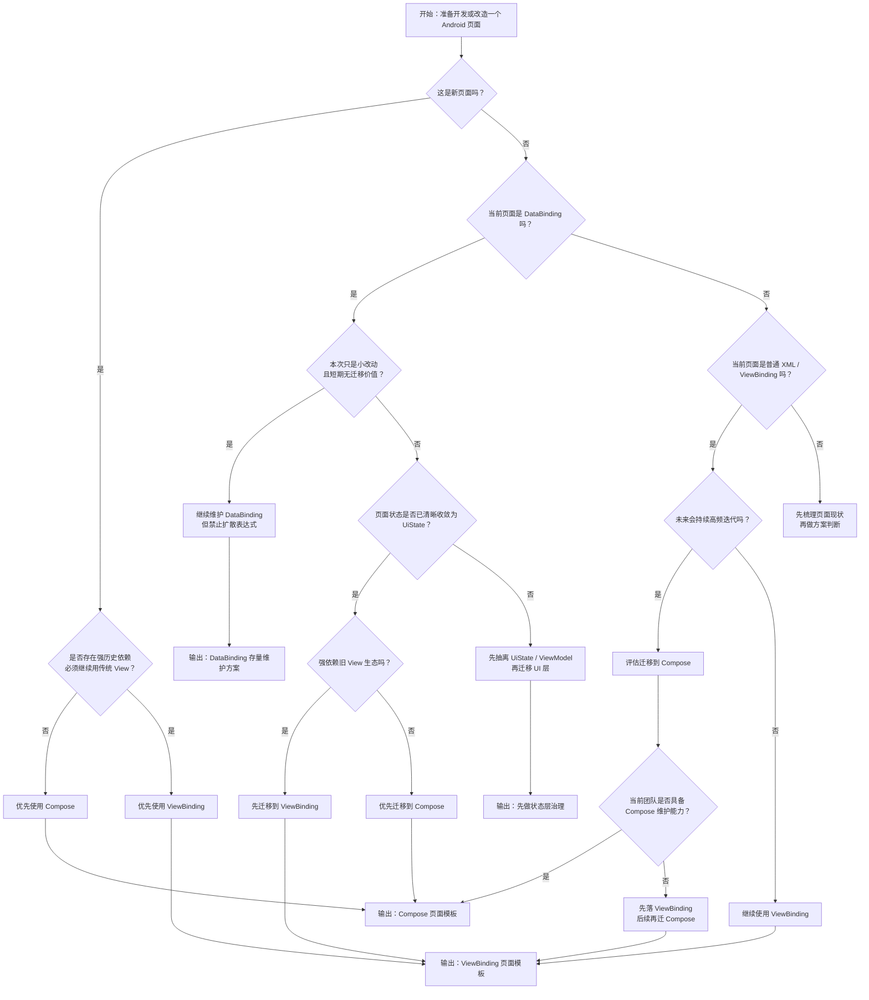

# Android 原生 UI 方案规范模板

## 1. 文档目标

这份文档面向正式项目，而不是只解释 demo。

目标是沉淀一套可落地的 Android 原生页面 UI 方案规范，用来回答四个问题：

1. 新页面应该优先使用 `Compose`、`ViewBinding` 还是 `DataBinding`。
2. 三种方案各自适合承载什么类型的页面。
3. 页面分层、状态、事件、适配器层应该如何组织。
4. 为什么正式项目需要逐步停止扩散 `DataBinding`。

本文档默认适用于以下场景：

- 大型存量 Android 工程
- 同时存在老 XML 页面和新页面建设
- 页面需要与 `ViewModel`、路由、埋点、列表、弹窗、混合容器协同
- 项目处于“不能推翻重做，只能持续演进”的阶段

## 2. 总体结论

正式项目建议采用以下默认策略：

- 新增页面默认优先 `Compose`
- 存量 XML 页面改造、复杂列表页、混合改动页优先 `ViewBinding`
- `DataBinding` 仅维护存量，不再作为新增页面默认方案

可以把它理解成一条很明确的策略线：

`Compose = 新建设计`

`ViewBinding = 过渡与稳态 XML`

`DataBinding = 存量兼容，不再扩散`

## 3. 三种方案的职责边界

## 3.1 Compose

### 推荐使用场景

- 新功能页
- 新弹窗页
- 状态驱动强、交互频繁的页面
- 需要高复用组件能力的页面
- 后续会持续演进的页面

### 不推荐直接使用场景

- 只改一个已有 XML 小模块，且周边全是传统 View
- 团队暂时没有 Compose 基础设施和排障经验
- 强依赖历史三方 View、复杂嵌套 RecyclerView、短期只做微调的页面

### 正式项目中的边界

- `Compose` 负责 UI 渲染和局部交互
- `ViewModel` 负责状态生产
- 页面参数、路由、埋点、网络、缓存等不直接写进 Composable
- 页面尽量只接收 `UiState + Event`

## 3.2 ViewBinding

### 推荐使用场景

- 存量 XML 页面的持续维护
- 复杂页面中局部改造，不适合一次性迁 Compose
- 页面结构已稳定，主要是业务逻辑和展示字段变更
- 依赖传统 View 体系、Adapter、PopupWindow、沉浸式工具较重的页面

### 正式项目中的边界

- `ViewBinding` 只负责“安全拿 View 引用”
- 所有状态渲染逻辑放到 Kotlin `render(state)` 中
- 点击事件在 `bindAction()` 中集中注册
- 不在 XML 中承载业务表达式

## 3.3 DataBinding

### 推荐使用场景

- 存量页面继续维护
- 已经深度依赖 BindingAdapter、双向绑定表达式、老组件体系的页面
- 短期没有业务价值做整页迁移，但需要保证稳定

### 明确限制

- 不作为新页面默认选型
- 不新增大规模复杂表达式
- 不继续把业务逻辑下沉到 XML
- 不新增“为了少写 Kotlin 而写 DataBinding 表达式”的页面

### 存量治理原则

- 可以维护
- 可以收口
- 可以逐步替换
- 不再扩散

## 4. 为什么要逐步替换 DataBinding

替换 `DataBinding` 的根本原因，不是“它老了”，而是它在大型存量项目里会持续放大维护成本。

主要问题有四类：

### 4.1 调试成本高

- XML 表达式错误经常要到编译期甚至生成代码阶段才暴露
- 错误定位链路长
- 生成类、BindingAdapter、表达式类型推断出问题时，排障成本明显高于 `ViewBinding` 和 `Compose`

### 4.2 逻辑分散

- 一部分逻辑在 XML
- 一部分逻辑在 `BindingAdapter`
- 一部分逻辑在 `ViewModel`
- 一部分逻辑在 Activity / Fragment

页面越复杂，越难快速判断“某个显示结果到底是谁控制的”。

### 4.3 工程复杂度高

- 会引入额外代码生成链路
- 对编译速度、增量构建、IDE 提示稳定性都有负担
- 与 Kotlin、AGP、AndroidX 升级时更容易出现兼容性边角问题

### 4.4 容易把业务逻辑藏进 XML

这是 `DataBinding` 在大项目里最常见的问题。

一开始只是简单 `visible`、`text` 绑定，后面很容易演变成：

- 复杂三元表达式
- 多个布尔组合判断
- 业务字段拼接
- 点击行为分发
- 自定义 `BindingAdapter` 膨胀

结果是页面“看起来 declarative”，实际却更难读、更难测。

## 5. 正式项目推荐选型规则

建议直接固化成团队规则：

### 规则 1

新页面如果没有明确阻碍，默认用 `Compose`。

### 规则 2

已有 XML 页面如果只是继续维护、局部改造、兼容老组件，默认用 `ViewBinding`，不要新增 `DataBinding` 表达式。

### 规则 3

`DataBinding` 页面只做存量维护；若页面迭代频繁、逻辑复杂、多人协作成本高，应优先列入迁移计划。

### 规则 4

无论用哪种 UI 技术，页面状态都应收敛为统一的 `UiState`，而不是把业务判断散落到 XML 或 Composable 内部。

## 6. 正式项目推荐分层模板

推荐页面目录结构：

```text
feature_xxx/
  ui/
    XxxActivity / XxxFragment / XxxScreen
    adapter/
    widget/
  presentation/
    XxxViewModel
    XxxUiState
    XxxUiAction
  domain/
    XxxStateFactory
    XxxUseCase
  data/
    XxxRepository
  model/
    XxxPageModel
```

### 分层职责

- `data`：拉取和组装原始数据
- `domain`：把原始数据转成页面可直接消费的展示状态
- `presentation`：管理状态和事件
- `ui`：只负责渲染与交互回调

这套结构对三种 UI 方案都成立。

真正变化的只是 `ui` 层写法，不应该让状态生产逻辑跟着一起变化。

## 7. 三种方案的正式项目模板写法

## 7.1 Compose 模板

推荐结构：

- `Activity/Fragment` 只负责容器接入和 `setContent`
- `Composable` 接收 `state`
- 所有点击回调通过 lambda 注入
- 页面不直接依赖 Repository

模板原则：

```kotlin
setContent {
    val state by viewModel.uiState.observeAsState()
    state?.let {
        XxxPage(
            state = it,
            onClickA = viewModel::onClickA,
            onClickB = viewModel::onClickB,
        )
    }
}
```

不要在 Composable 中直接：

- 拼路由
- 调 Repository
- 写业务 if-else 链
- 管理复杂页面生命周期副作用

## 7.2 ViewBinding 模板

推荐结构：

- `onCreateView` / `onCreate` 中完成 binding 初始化
- `bindActions()` 统一注册点击
- `observeState()` 统一观察状态
- `render(state)` 只做渲染

模板原则：

```kotlin
private fun bindActions() {
    binding.btnSubmit.setOnClickListener { vm.onSubmit() }
}

private fun observeState() {
    vm.uiState.observe(viewLifecycleOwner, ::render)
}

private fun render(state: XxxUiState) = with(binding) {
    tvTitle.text = state.title
    btnSubmit.isVisible = state.showSubmit
}
```

这样做的好处是：

- 调试路径清晰
- 断点集中
- 不依赖 XML 表达式
- 最适合存量 XML 维护

## 7.3 DataBinding 模板

如果存量页面继续使用 `DataBinding`，建议收口到下面的边界：

- XML 只保留简单字段绑定
- 点击事件通过 `ActionProxy` 转发
- 复杂样式变化只放少量 `BindingAdapter`
- 业务判断不要继续下沉到 XML

推荐结构：

```text
presentation/
  XxxViewModel
  XxxActionProxy
ui/
  XxxBindingAdapters
```

禁止继续扩散的写法：

- 多层三元表达式
- XML 里做字符串拼接链
- XML 里组合多个业务布尔判断
- 一个页面堆很多通用性差的 `BindingAdapter`

## 8. 本 demo 对正式项目模板的映射

这次 `HistoryRelease` 三页对比 demo，本质上就是把同一份业务页面按三种方案落一遍，方便做正式项目选型对照。

对应代码位置：

- `DataBinding`
  [HistoryReleaseDataBindingActivity.kt](/Users/ypmma106/AndroidStudioProjects/YuPaoProject/FlutterHybridDemo/android_host/app/src/main/java/com/example/hybriddemo/historyrelease/ui/HistoryReleaseDataBindingActivity.kt)
- `ViewBinding`
  [HistoryReleaseViewBindingActivity.kt](/Users/ypmma106/AndroidStudioProjects/YuPaoProject/FlutterHybridDemo/android_host/app/src/main/java/com/example/hybriddemo/historyrelease/ui/HistoryReleaseViewBindingActivity.kt)
- `Compose`
  [HistoryReleaseComposeActivity.kt](/Users/ypmma106/AndroidStudioProjects/YuPaoProject/FlutterHybridDemo/android_host/app/src/main/java/com/example/hybriddemo/historyrelease/ui/HistoryReleaseComposeActivity.kt)

共享状态层：

- [HistoryReleaseDemoViewModel.kt](/Users/ypmma106/AndroidStudioProjects/YuPaoProject/FlutterHybridDemo/android_host/app/src/main/java/com/example/hybriddemo/historyrelease/presentation/HistoryReleaseDemoViewModel.kt)
- [HistoryReleaseDemoStateFactory.kt](/Users/ypmma106/AndroidStudioProjects/YuPaoProject/FlutterHybridDemo/android_host/app/src/main/java/com/example/hybriddemo/historyrelease/domain/HistoryReleaseDemoStateFactory.kt)
- [HistoryReleaseDemoRepository.kt](/Users/ypmma106/AndroidStudioProjects/YuPaoProject/FlutterHybridDemo/android_host/app/src/main/java/com/example/hybriddemo/historyrelease/data/HistoryReleaseDemoRepository.kt)

关键点不是三页 UI 长什么样，而是：

- 三页共用一份状态模型
- 三页共用一份业务数据
- 三页只替换 `ui` 层写法

这就是正式项目应该坚持的边界。

## 9. 正式项目迁移建议

## 9.1 DataBinding -> ViewBinding

适合场景：

- 页面仍基于 XML
- 页面要继续长期维护
- 表达式已经开始失控

迁移顺序建议：

1. 先保留原 XML 布局结构
2. 去掉复杂表达式和点击绑定
3. 把显示逻辑收回 `render(state)`
4. 保留少量必要 `BindingAdapter` 或直接替换为普通 Kotlin 渲染

## 9.2 DataBinding -> Compose

适合场景：

- 页面未来迭代多
- 页面业务复杂且状态驱动强
- 团队准备把该业务域迁到新 UI 体系

迁移顺序建议：

1. 先抽离 `UiState`
2. 再抽离 `ViewModel`
3. 最后替换 `ui` 层

不要一边迁 UI 一边重写业务状态来源，否则风险太大。

## 9.3 ViewBinding -> Compose

适合场景：

- 页面已经完成状态收敛
- 只是 UI 层还在 XML

这是最平滑的迁移路径，因为：

- 状态层通常已经较清晰
- 渲染逻辑已在 Kotlin 中
- UI 替换范围可控

## 10. 推荐的团队执行规则

建议在正式项目中直接固化以下规则：

1. 新页面默认 `Compose`。
2. 新 XML 页面默认 `ViewBinding`，不新开 `DataBinding`。
3. `DataBinding` 页面不新增复杂表达式。
4. 页面必须有明确 `UiState`，不允许状态散落在 XML / Adapter / Activity 多处。
5. 复杂样式变化优先在 Kotlin/Compose 处理，少写只服务单页的 `BindingAdapter`。
6. 页面评审时，UI 技术选型要和页面生命周期、迭代频率、存量依赖一起评估，不按个人偏好决定。

## 11. 页面评审 Checklist

下面这份 checklist 可以直接用于需求评审、技术方案评审、页面重构评审。

### 11.1 选型判断

- 这是全新页面，还是存量页面改造？
- 页面未来 3 个版本内是否还会持续高频迭代？
- 页面是否以状态驱动为主，而不是静态表单拼接？
- 页面是否强依赖历史 View、PopupWindow、RecyclerView、三方 XML 组件？
- 页面是否已经有可复用的 `UiState` 和 `ViewModel`？
- 本次需求是局部改字段，还是会显著调整页面结构？

### 11.2 Compose 适配性判断

- 页面是否适合抽成明显的组件块？
- 页面交互是否较多，且依赖状态切换？
- 团队是否已有 Compose 基础设施和排障能力？
- 是否能接受本次页面进入新 UI 体系？
- 是否存在必须依赖旧 XML 生态的强约束？

如果以上大多数回答偏正向，优先 `Compose`。

### 11.3 ViewBinding 适配性判断

- 页面当前是否已经是 XML 结构？
- 本次是否更适合在原结构上稳定改造？
- 是否希望把调试、断点、渲染路径都收回 Kotlin？
- 是否要避免继续放大 DataBinding 表达式复杂度？

如果以上大多数回答偏正向，优先 `ViewBinding`。

### 11.4 DataBinding 存量维护判断

- 页面是否已经深度依赖 DataBinding 表达式？
- 页面短期是否没有足够业务价值做迁移？
- 本次需求是否可以在不扩散表达式的前提下完成？
- 是否能把新增逻辑收回 `ViewModel / ActionProxy / BindingAdapter`，而不是继续堆在 XML？

如果只能继续维护 `DataBinding`，也要控制在“存量收口”范围内。

### 11.5 状态分层检查

- 页面是否存在明确的 `UiState`？
- `UiState` 是否已经把文案、显隐、按钮状态、样式状态收敛完整？
- 页面是否仍存在“XML 一部分判断、Activity 一部分判断、Adapter 一部分判断”的分散问题？
- 点击事件是否集中由 `ViewModel` 或事件门面接收？

如果这些问题回答不清晰，不应该先谈 UI 技术选型，应该先收敛状态模型。

### 11.6 风险检查

- 本次改动是否会影响大量已有页面共用布局？
- 是否涉及复杂列表、多态 item、嵌套滚动、沉浸式、键盘、软输入联动？
- 是否涉及混合容器、Fragment 嵌套、生命周期边界复杂场景？
- 是否需要边做需求边迁移架构？

如果答案是“是”，要优先选风险更低、边界更清晰的方案，而不是选“看起来更先进”的方案。

## 12. 页面迁移流程图

下面这张流程图可以直接当作页面技术选型和迁移决策图使用。



## 13. 推荐迁移执行顺序

如果正式项目准备逐步收口 UI 技术方案，建议按以下顺序推进：

1. 停止新开复杂 `DataBinding` 页面。
2. 新页面默认切到 `Compose`。
3. 高频维护的 `DataBinding` 页面先迁到 `ViewBinding`。
4. 已完成状态收敛的核心页面，再逐步迁到 `Compose`。
5. 把公共组件、状态模板、评审规则逐步统一。

这条顺序的重点不是“迁得快”，而是“迁得稳”。

## 14. 最终建议

对鱼泡这类大型混合 Android 项目，更务实也更接近最佳实践的路线不是“一刀切全换”，而是：

- 用 `Compose` 承接新建设计
- 用 `ViewBinding` 承接存量 XML 稳态维护
- 用“停止扩散 + 渐进迁移”的方式收口 `DataBinding`

这条路线的核心价值是：

- 新页面不会继续背历史包袱
- 老页面不需要高风险重写
- 页面分层可以逐步统一
- 团队心智模型会越来越清晰
